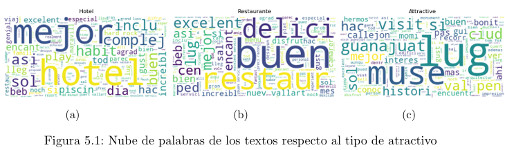
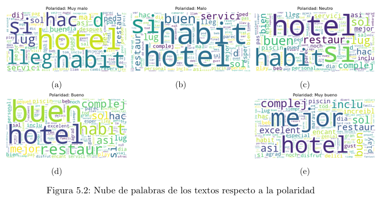
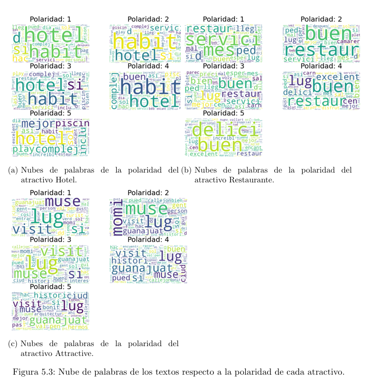
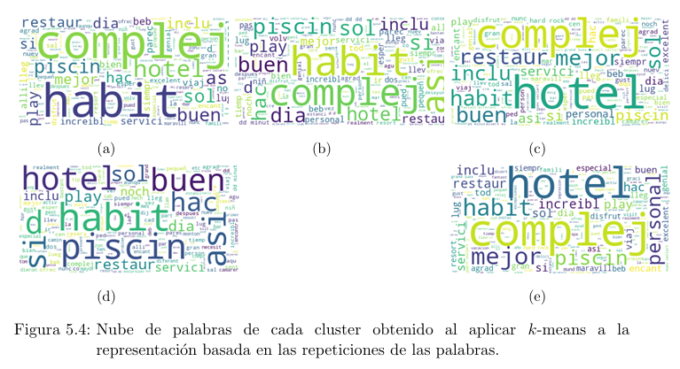
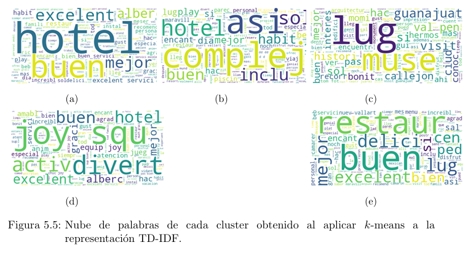

# BOW-TF-IDF-Clustering
Una práctica utilizando Bag of Words y TF-IDF para posteriormente realizar clustering con k-means y Kernel k-means para identificar categorías en textos  sobre opiniones de personas que visitaron lugares turísticos.

Se cuenta con una base de datos con 30,212 opiniones sobre visitantes en diversos lugares turísticos. Dicha base de datos cuenta con una columna de títulos los cuales fueron otorgados por el propio turista, una columna de opiniones, así como una columna de Polaridad en la que se encuentran valores de 1 a 5 que indican el grado de satisfacción que se interpretan como

1. Muy malo
2. Malo
3. Neutral
4. Bueno
5. Muy bueno

Además, se cuenta con una columna de Atracción en la cual se etiqueta el lugar del cual se emite la opinión, dichas etiquetas son: *Hotel*, *Restaurant* y *Attractive*.

## Representación vectorial de los textos mediante Bag Of Words (BOW). 
	
Al realizar un análisis de la base de datos se obtuvo que esta se encuentra desbalanceada, en la Tabla 1 se muestra la distribución de las opiniones respecto a la polaridad y al tipo de atractivo en donde se puede ver quese tienen 16565 opiniones de Hoteles, contra 8450 opiniones de Restaurant, casi la mitad con respecto a Hoteles, y 5194 de Attractive.
	Se realizó el pre-procesamiento del texto de modo que el vocabulario esté compuesto por palabras que se repitan más de 10 veces, pues al tener un número considerable de opiniones, es necesario considerar palabras que realmente sean representativas de las opiniones, después se obtuvo una Bolsa de palabras basándose en las repeticiones de las mismas.
	
**Tabla 1:** Distribución de la base de datos respecto a polaridad y atractivo.

| Polaridad | Cantidad | Atractivo     | Cantidad |
|-----------|----------|---------------|----------|
| 5         | 20934    | Hotel         | 16565    |
| 4         | 5877     | Restaurante   | 8450     |
| 3         | 2121     | Atractivo     | 5194     |
| 2         | 730      |               |          |
| 1         | 547      |               |          |

## Nube de palabras de los textos respecto al tipo de atractivo y sentimiento. 

En la Figura 5.1 se muestran nubes de palabras de los textos respecto al tipo de atractivo, como es de esperarse, en cada una resalta la palabra que representa al atractivo, en el caso de Attractive, se observa la palabra que representa a museo y hasta se puede decir que se refieren al museo de la momias de Guanajuato, además en cuanto a Hotel y Restaurante, sobresalen también palabras que califican de manera positiva, esto también es debido a que al analizar la polaridad por atractivo, se observa un desbalance pues la polaridad Muy bueno en todos los atractivos es considerablemente grande con respecto al resto. Por otro lado, en la Figura 5.2 se muestran nubes de palabras de los textos respecto a cada polaridad, en cada nube de palabras resalta la palabra *hotel*, esto también es debido a que, como ya se comentó, es el atractivo que cuenta con un número mayor de opiniones. También se distingue *habit* en las nubes de palabras correspondientes a las polaridades Muy malo, Malo, Neutro y Bueno, de donde se puede decir que la polaridad que se le dió a Hoteles dependió de las condiciones de las habitaciones.

  

  

Debido al desbalance que se pudo notar en la base de datos, para observar patrones es mejor obtener nubes de palabras agrupando por polaridad por categoría. En la Figura 5.3a) se presentan nubes de palabras de acuerdo a las polaridades del atractivo Hotel, donde nuevamente se observa que las polaridades $1, 2, 3$ y $4$ se otorgaron dependiendo de las condiciones de las habitaciones, además se puede concluir que la mayoría de hoteles calificados como Muy bueno incluyen piscina o tienen playa. Ahora, en la Figura 5.3b) se incluyen nubes de palabras de acuerdo a las polaridades de Restaurantes, donde los restaurantes que fueron calificados como Muy malos fue debido escencialmente al servicio, mientras que los que se consideran Buenos y Muy buenos, es debido al sabor.
Por último, en la Figura 5.3c) se muestran nubes de palabras de acuerdo a las polaridades de museos, en este caso es más complicado observar patrones de acuerdo a la polaridad pues en todas las nubes de palabras lo principal es el mudeo de las Momias de Guanajuato, no se puede notar una característica especial por polaridad.

  

## Clustering con $k-$means y Kernel $k-$means en la representación de los textos
	
Se realizó clustering con $k$-means a la representación vectorial obtenida basada en el número de repeticiones de la misma, se considero un número de 5 clusters con la intención de obtener un cluster por cada polaridad, posteriormente se obtuvo una nube de palabras por cada texto que se encontraba en cada cluster, en la Figura 5.4 se presentan dichas nubes de palabras, sin embargo no se encuentran un patrón que diferencié a los clusters, en todas las nubes de palabras sobre sale la palabra *hotel*, pero se infiere que es debido al desbalance de la base de datos, también se observa *complej* y *habit* en casi todas las nubes, las cuales se encuentran relacionadas con las opiniones correspondientes a hoteles.

  

	

## Usando una representación TF-IDF
	
Se obtuvo la vectorización de la bolsa de palabras mediante TF-IDF, posteriormente se aplicó $k$-means con $k=5$ clusters, de forma similar al inciso anterior se construyó una bolsa de palabras por cada cluster, en este caso se observan ciertos patrones en algunos clusters, como el caso de la Figura \ref{fig:k5.5 en el que se podría decir que se trata sobre lo relacionado a museos y callejones característicos de la Ciudad de Guanajuato. En la Figura 5.5 se observa que son textos referentes a restaurantes con buenas opiniones, sin embargo el resto de clusters parecen tratar sobre opiniones referentes a hoteles.
	

  

	
